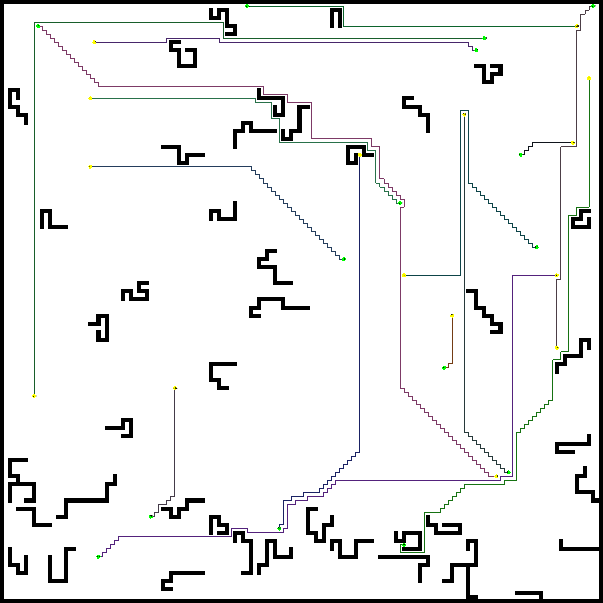

# Ranking Cost

<div align="center">

</div>
<div align="center">

</div>


[](https://opensource.org/licenses/Apache-2.0)

### Introduction

Code accompanying the paper 
"Ranking Cost: Building An Efficient and Scalable Circuit Routing Planner with Evolution-Based Optimization". [[arxiv](https://arxiv.org/abs/2110.03939)]

### Install
- Python 3+
- `pip install -r requirements.txt`
- `pip install -e .`

### Run Ranking Cost Algorithm
```
cd scripts
./train.sh
```

This script will load the map predefined in `map01.json` and train it with the Ranking Cost algorithm. 
The routing result will be saved to `map01_solution.png`, 
and the cost maps will be saved to `map01_cost_map_0.png` and `map01_cost_map_1.png`.

### Cite

```
@misc{huang2021ranking,
      title={Ranking Cost: Building An Efficient and Scalable Circuit Routing Planner with Evolution-Based Optimization}, 
      author={Shiyu Huang and Bin Wang and Dong Li and Jianye Hao and Ting Chen and Jun Zhu},
      year={2021},
      eprint={2110.03939},
      archivePrefix={arXiv},
      primaryClass={cs.AI}
}
```